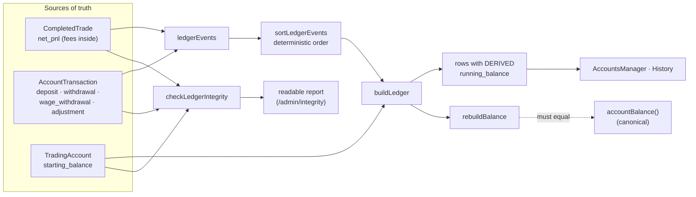

# Account-led financial model — audit, design & plan

This document redesigns the money model behind **Trade History** and
**Performance / Stats**. The previous model only recorded a win/loss flag, so
Net P/L, ROI, profit factor, account balance and the equity curve could not be
derived, and the "Avg R:R" tile showed a meaningless number.

## 1. Existing schema audit

| Table | Role today | Financial gaps |
| --- | --- | --- |
| `completed_trade` | Authoritative trade record. `result` = `win\|loss\|breakeven\|not_taken`, plus a single nullable `pnl`. | No account, no fees, no gross/net split, no amount risked. `pnl` is only written by the *detailed* completion modal, and the default mode is *quick* → almost every trade has `pnl = NULL`, so all money stats render `—`. |
| `monthly_journal` | Manual monthly balances (`start_balance`, `end_balance`, `pnl`, …). | The only place a "starting balance" lives. `resolveStartingBalance()` scrapes the earliest `start_balance`, else hardcodes `10000`. Not an account ledger. |
| `bias_analysis`, `trade_journal_entry` | Analysis snapshots / journaling. | Not financial. |

**The "Avg R:R 173.9 planned" bug.** `computeStats` averaged `trade.target`.
`target` is **not** an R:R ratio — it is the **Minimum Safe Move** from the bias
engine (`calculateMinSafeMove()`: `(atr * TARGET_WEIGHTS[grade]) / TARGET_DIVISOR`,
`biasEngine.js`), an ATR-derived floor, not a take-profit. (The value is stored
under the legacy `target` key.) Averaging those yields nonsense. `rMultiple()`
likewise faked R as "win = planned target, loss = −1", i.e. it never used real
risk. Both are removed; real R needs `amountRisked`.

**Data layer.** `src/api/base44Client.js` maps entity names → tables and exposes
`list/filter/create/update/upsert/delete` with per-user RLS
(`auth.uid() = user_id`). New entities are added by extending the `TABLES` map.

## 2. Proposed database changes & migration (`0004_financial_model.sql`)

### New table `trading_account`
`id, user_id, created_date, updated_date, name, currency (default 'USD'),
starting_balance (default 0), created_at, archived_at (nullable)`

### New table `account_transaction`
`id, user_id, created_date, updated_date, account_id → trading_account,
type CHECK IN ('deposit','withdrawal','adjustment'), amount, occurred_at, note`

- `deposit` / `withdrawal` store a **positive magnitude**; the sign is applied
  by type. `adjustment` stores a **signed** amount.

### Alter `completed_trade`
Add: `account_id → trading_account (ON DELETE SET NULL)`, `gross_pnl`, `fees`,
`net_pnl`, `amount_risked` — all nullable.

- **`net_pnl` is the authoritative realised P/L.** `net_pnl IS NULL` means the
  trade's *financial* result is **incomplete** (breakeven stores `net_pnl = 0`,
  which is complete — so `NULL` vs `0` is meaningful and we need no extra flag).
- `net_pnl = gross_pnl − fees`, computed in the app at write time.
- Legacy `pnl` is left in place and kept in sync (`pnl = net_pnl`) so nothing
  that still reads it breaks; new code reads `net_pnl`.

### Migration & backfill
The migration is additive/re-runnable SQL (`IF NOT EXISTS`, run manually by the
single user like the others). Per-user rows can't be seeded in that SQL, so the
**app** owns idempotent backfill (`lib/accounts.js`):

- `ensureDefaultAccount()` — if the user has no non-archived account, create
  **"Main Account"** using the resolved starting balance (earliest
  `monthly_journal.start_balance`, else `10000`).
- Existing `completed_trade` rows: `net_pnl` is backfilled from `pnl` where
  `pnl` is not null; rows with `pnl = NULL` stay financially incomplete and
  surface an **"Add result"** action. Their `outcome` (`result`) is preserved
  and never assigned an invented amount.
- Orphan trades (`account_id = NULL`) are attached to the default account only
  when the user has exactly one account (safe, non-destructive); otherwise they
  are shown under "All accounts" until assigned.

## 3. Calculation definitions (`lib/accounts.js`, `lib/journalStats.js`)

All pure/side-effect-free and unit-tested. A trade **counts financially** only
when `net_pnl != null`.

- **Realised net P/L (period)** = `Σ net_pnl` over financially-complete trades in
  range. Deposits/withdrawals are **never** trading profit.
- **Account balance (all-time)** =
  `starting_balance + Σdeposits − Σwithdrawals + Σ(net_pnl complete) + Σadjustments`.
- **Balance before `t`** = same sum restricted to events strictly before `t`.
  Used as the ROI opening balance and the equity-curve origin.
- **Win rate** = `wins / (wins + losses)` over **directional** (win/loss) trades;
  breakeven and not-taken excluded from the denominator.
- **Gross profit** = `Σ net_pnl where net_pnl > 0`;
  **Gross loss** = `|Σ net_pnl where net_pnl < 0|`.
- **Profit factor** = `grossProfit / grossLoss`. `grossLoss = 0`:
  `Infinity` if there are winning dollars (rendered "No losing trades"), else
  `null`.
- **Total trades** = count in range (all outcomes).
- **Current streak / best winning streak** — over directional trades in
  chronological order.
- **Average R multiple** = `mean(net_pnl / amount_risked)` over trades where
  `amount_risked > 0`. If none, `null` → "Not enough risk data".
- **ROI (range)** = `periodNetPnl / openingBalance × 100`, where `openingBalance`
  = account balance immediately **before the first event in the period**. If
  `openingBalance <= 0`, ROI is `null` (undefined).
- **Equity curve** = chronological account balance after each completed trade:
  start at `balanceBefore(window)` (so prior deposits/withdrawals are included),
  then walk merged trade + transaction events, emitting a point at each trade
  carrying the running true balance.

### Multi-currency / filters
Filters: **date range**, **account**, and **all compatible accounts** (all
accounts sharing one currency). Monetary totals are never summed across
currencies. If "All accounts" spans multiple currencies, monetary tiles show a
"Mixed currencies" guard while currency-independent stats (win rate, streaks,
total trades) still compute.

## 4. Affected screens / components

- `components/bias/CompleteTradeModal.jsx` + `lib/tradeCompletion.js` — capture
  win/loss/BE + **amount made/lost**, optional fees, optional amount risked;
  store `gross_pnl/fees/net_pnl/amount_risked/account_id`. Loss stored negative
  without the user typing a minus.
- `pages/JournalStats.jsx`, `components/journal/PerformanceSummary.jsx`,
  `components/journal/EquityCurve.jsx` — new model, empty states, account + date
  filters; **Avg R:R "planned" removed**, replaced by **Avg R** (risk-based).
- `pages/TradeHistory.jsx` — show net P/L + account; **"Add result"** for
  financially incomplete trades.
- `pages/Settings.jsx` — manage accounts (create / archive) and transactions
  (deposit / withdrawal / adjustment).
- `pages/Dashboard.jsx` — pass the active account into completion.

## 5. Edge cases

- No monetary P/L anywhere → tiles show "Add trade results to unlock this stat."
- No losing trades → profit factor "No losing trades" (∞ with explanation).
- No `amount_risked` recorded → Avg R "Not enough risk data".
- Break-even trade → `net_pnl = 0`, counts as complete, excluded from win-rate
  denominator, contributes 0 to gross profit/loss.
- Historic win/loss trade with no amount → stays visible, outcome preserved,
  "Add result" action; excluded from money stats until filled.
- Deposit/withdrawal must not move Net P/L or ROI numerator.
- ROI opening balance `<= 0` → ROI undefined (guarded).
- Multiple accounts, different currencies → never combined into one total.
- Adjustment can be negative; balance handles signed amounts.
- Withdrawal larger than balance → balance may go negative (allowed; surfaced).

## 6. Test plan

Unit (Vitest, pure logic):
- balance = start + deposits − withdrawals + net P/L + adjustments.
- `balanceBefore(t)` excludes events at/after `t`.
- ROI uses period opening balance; deposits/withdrawals excluded from P/L.
- fees reduce net P/L (`net = gross − fees`); loss stored negative.
- break-even: net 0, complete, not in win-rate denominator.
- no-loss period: profit factor ∞/"No losing trades".
- historic trade without P/L: excluded from money stats, still counted in total.
- average R only over trades with `amount_risked`.
- multiple accounts: per-account isolation; mixed-currency guard.
- equity curve: running balance folds interim deposits/withdrawals.

Component (Testing Library):
- Completion modal: loss input positive → stored negative; save writes
  net_pnl/fees/risk/account.
- Stats page renders empty states instead of fake values; no "173.9 planned".
- Trade History shows "Add result" on incomplete trades.

Implementation proceeds in the stages listed in commits on this branch.

## 7. Authoritative source-of-truth rules (Wage Maker integration, phase 3)

These rules fix where each realised-money figure lives so nothing is ever counted
twice. They are enforced by the pure helpers in `lib/accounts.js` and
`lib/tradeCompat.js`; the schema for them lands in migrations `0006`/`0007`.

### Per-trade costs
Per-trade broker fees, commissions and direct costs belong on
**`completed_trade.fees`** and are subtracted there (`net_pnl = gross_pnl − fees`,
`lib/tradeCompletion.js`).

### Account adjustments
**`account_transaction.type = 'adjustment'`** is only for non-trade corrections or
account-level adjustments (reconciliation, a manual balance fix). **A cost must
never be recorded both as a trade fee and as an account adjustment** — pick one:
per-trade cost → `completed_trade.fees`; account-level correction → `adjustment`.

### Wages
Profit taken out as personal wages belongs in
**`account_transaction.type = 'wage_withdrawal'`** (migration `0007`). A wage
withdrawal **reduces account cash balance** (it moves cash exactly like an
ordinary withdrawal, `txnDelta`) but **does not reduce realised trading P/L** —
gross/net P/L, win rate, profit factor, expectancy and R multiple are computed
from `completed_trade` rows only and never see transactions. Wages are a distinct
type purely so they can be reported separately (`wagesWithdrawn`); old
`withdrawal` rows are **never** reclassified as wages.

### Position size and points
- **`completed_trade.position_size`** stores the actual bid / lot / point-value
  input used for the trade.
- **`completed_trade.points_pips`** stores the explicitly recorded movement
  result (may be positive, negative or zero).
- `points_pips` is **never** auto-populated from `net_pnl / position_size` during
  migration. A future UI may show that computed value only as a clearly-labelled
  fallback when no explicit `points_pips` was recorded.

### Executed direction
The existing `completed_trade.direction` column stores the **Prime Bias engine
recommendation** (`results.mainDirection`, `BUY`/`SELL`). The new nullable
**`completed_trade.trade_direction`** (`'long'`/`'short'`, migration `0006`)
records the direction **actually taken**. Legacy rows leave it `null`; the
executed side is not guessed from the engine recommendation.

### Risk percentage — derived, not stored (decision + trade-off)
There is intentionally **no** stored `risk_pct` column. The preferred value is
derived: `amount_risked / balance_before_trade × 100`, where
`balance_before_trade` comes from the ledger (`balanceBefore`).

- **Trade-off.** Deriving keeps a single source of truth, but the derived risk %
  of a *historical* trade can shift if earlier ledger records are later edited
  (a corrected earlier deposit changes `balance_before_trade`). Snapshotting
  `risk_pct` (or `balance_before_trade`) at completion would freeze it, at the
  cost of a second, potentially-diverging stored figure.
- **Decision for this phase.** Keep it derived. Snapshotting the balance-before
  is a wider architectural change (it would belong with the engine-snapshot
  approach) and is **out of scope here** — flagged for a future phase rather than
  introduced silently.

### Compatibility guarantees
`normalizeTrade` (`lib/tradeCompat.js`) exposes read-time defaults for rows that
predate these columns — `position_size: null`, `points_pips: null`,
`split_count: 1`, `mood: null`, `reason_tags: []`, `trade_direction: null`,
`engine_version: 'legacy-pre-snapshot'` — **without writing them back**. Invalid
values normalise to `null`/safe defaults, never to `0`. `isWageWithdrawal`
identifies wages solely by the explicit new type.

## 8. Trade-capture semantics (Wage Maker integration, phase 4)

All completion/edit maths funnels through `lib/tradeFinancials.js`; all writes
funnel through `lib/tradeCompletion.js` (`buildRealisedFields` → `completeTrade` /
`updateCompletedTrade`), so quick completion, detailed completion, "Add result"
and journal editing can never store different financial meanings.

### Gross / fees / net
- **Gross P&L** is entered **directly and signed** — a loss is a negative number.
- **Fees / costs** are a positive cost.
- **Net P&L = gross − fees.** A loss with fees becomes *more* negative
  (e.g. gross −£100, fees £5 → net −£105).
- The user never enters both gross and net; net is always derived.
- A trade fee is **never** written as an account adjustment.
- A win/loss with no gross stays financially incomplete (`net_pnl` null, not
  invented).
- **Break-even asserts a flat market (gross 0).** With no money entered at all it
  stays **outcome-only** (`net_pnl` null). Once fees are present it is a small
  realised **loss** (`net_pnl = −fees`) — a scratch-at-entry trade with fees is a
  loss, **not** a breakeven.

### Result consistency (authoritative rule)
Net P&L is **authoritative** whenever it exists — the persisted `result` is
derived from it (`reconcileResult`), and the UI shows a message when that differs
from the user's selection (auto-correct policy, chosen over blocking):

| net_pnl | stored result |
|---|---|
| `> 0` | `win` |
| `< 0` | `loss` (includes scratch-with-fees, net `−fees`) |
| `=== 0` | `breakeven` |
| `== null` | preserve the manually selected outcome |

Downstream stats (win rate, streaks, grade/asset breakdowns) read this **stored,
reconciled `result`**, so a fee-bearing scratch counts as a loss everywhere.

### Executed direction
The completion/edit UI distinguishes **engine bias** (`direction`, BUY/SELL) from
**trade taken** (`trade_direction`, long/short). Trading against the engine is
saved truthfully. `direction` is never overwritten.

### Previews (never persisted unless entered)
- Projected balance = balance before + net P&L (balance before = the selected
  account's current calculated balance).
- Risk % = amount risked / balance before × 100.
- Realised R = net P&L / amount risked (true R, not the workbook's P&L/invested).
- Estimated points = net P&L / position size — shown **clearly labelled**; only
  persisted if the user taps "Use" (or types points explicitly).

### Split count
`split_count` is the number of entries grouped into one completed trade
(default 1, positive integers). P&L, risk and pips are the **total** realised
result for the group — the app never multiplies them by the split count.

### Financial-completeness state (derived, no DB column)
`financialCompletenessState`: `outcome_only` → `account_unassigned` →
`risk_incomplete` → `complete`. Surfaced as a badge in Trade History.

### Duplicate protection
Completion is keyed on the **stable `analysis_id`**, not instrument+date. Before
inserting, `completeTrade` looks for a non-archived completed trade with the same
`analysis_id`; if found it **updates** that row (realised fields only — the
engine snapshot is never part of the update) instead of inserting a duplicate.
Journal edits go through `updateCompletedTrade(id, …)`, always updating the
intended row by id, so an edit can never create a new trade. Restoring an
analysis mints a fresh `analysis_id`, so re-completing a restored card is the
explicit "new trade" path.

> **Deferred (needs a decision):** a hard, DB-level guarantee would be a unique
> index on `completed_trade(user_id, analysis_id)`. It is **not** added here
> because creating it can fail if any pre-existing duplicate rows exist, so it
> needs a de-duplication pass first. The current app-level guard is the durable
> protection for the single-user model until that decision is made.

### Evidence capture
Screenshots use `screenshot_url`; pasted broker-history text uses
`broker_evidence` (migration `0008`). Evidence is stored **raw** — no value is
auto-extracted into the financial ledger, and any future extraction must pass
through explicit user confirmation before populating money fields.

### Immutable engine snapshot
Editing realised/journal fields never writes the engine-snapshot columns
(`engine_version`, `engine_settings`, `raw_grade`, `buy_score`, `sell_score`,
`timeframes_snapshot`, `grade`, `score`, `inputs_snapshot`, …), so the original
analysis is preserved byte-for-byte across edits.

## 9. Ledger hardening (Wage Maker integration, phase 5)

The account balance is one **derived, ordered** sequence of events — never a
stored number. `lib/ledger.js` is the single view over the two sources of truth.

### One source per value (no duplication)
- **CompletedTrade** holds gross P&L, fees and `net_pnl` (fees are *inside*
  net_pnl). A trade contributes `net_pnl` to the ledger **exactly once**; fees are
  never a separate ledger event, so a trade fee cannot be double-counted.
- **AccountTransaction** holds deposits, withdrawals, wage withdrawals and
  adjustments. Each contributes its signed `txnDelta` exactly once.
- **TradingAccount.starting_balance** is the only opening figure.
- Running balances are **derived** in `buildLedger`, never persisted.

### Deterministic ordering (same timestamp)
Events sort by event time ascending (undated legacy events sort **first**, as
prior history). Ties break by a fixed **kind rank**
`starting < deposit < adjustment < trade < withdrawal < wage_withdrawal`
(money in and the trade that may depend on it apply before money out), then by
record `id` as a final stable tiebreak. The final balance is order-independent
(a sum); the rank only stabilises the displayed running balance.

### Balance rebuilding
`rebuildBalance(account, txns, trades)` = starting balance folded over the
ordered events. By construction it equals `accountBalance()`; the integrity
checker flags any divergence (`balance_reconstruction_failure`). `realisedPnl`
now applies the legacy `withDerivedFinancials` shim internally, so a legacy
`pnl`-only trade counts once and both figures agree regardless of caller mapping.

### Integrity checker (admin-only, no repairs)
`checkLedgerIntegrity({ accounts, txns, trades })` → `formatIntegrityReport`
detects: duplicate analysis IDs, orphan trades, missing accounts, broken
transaction chains, possible fee double-counts (adjustments that look like trade
fees), negative balances and balance-reconstruction failures. Surfaced read-only
at `/admin/integrity`, **gated by the app's admin check** (`base44.auth.me()`
role = Supabase `user_metadata.role === 'admin'`, the same check `PageNotFound`
uses). Access is resolved **before** any query runs — the accounts, transactions
and trades are fetched with React Query `enabled: isAdmin`, so a non-admin (or
the pre-auth loading state) never triggers them and a direct visit renders the
existing not-found page with no report or identifiers. It never mutates or
repairs anything. Being unlinked in the nav is **not** the access control — the
role check is.

### Duplicate protection (DB-level, deferred from phase 4)
Migration `0009` adds a **partial unique index** on
`completed_trade (user_id, analysis_id) WHERE analysis_id IS NOT NULL`. It is
**self-investigating, non-destructive, and fails loudly** so it can never be
recorded as applied without enforcing uniqueness:

- **clean database** → creates the index and succeeds;
- **duplicates present** → prints each offending `(user_id, analysis_id)` group,
  then `RAISE EXCEPTION` so the whole migration **fails and stays unapplied** —
  nothing is created;
- **duplicates resolved** (a manual operator step — the migration never deletes,
  archives or modifies rows) → re-running succeeds and creates the index;
- **index already exists** → `IF NOT EXISTS` makes it a safe no-op success.

Because a migration that exited successfully without the index could be marked
applied by Supabase (and `supabase db push` would not run it again), the
duplicate branch must fail rather than "succeed with a NOTICE". This complements
the app-level `analysis_id` guard from phase 4.

### Orphan trades
Trades with `account_id = NULL` remain **visible** and are attributed to the sole
active account when exactly one exists (`tradeInAccount` / ledger `soleId`), so
they never drop out of totals. With multiple accounts they surface under "All
accounts" and the integrity checker flags them (`orphan_trade`, warning) for
explicit assignment — they are never silently dropped or reassigned.

## 10. Performance metrics & engine-quality breakdowns (phase 6)

All in `lib/performance.js` — pure, tested, realised-data only.

### Formulas
- **Win rate** = `wins / (wins + losses)` (a **fraction** 0–1; breakevens &
  outcome-only excluded from the denominator).
- **Average win** = mean `net_pnl` of complete trades with `net_pnl > 0`.
- **Average loss** = mean `|net_pnl|` where `net_pnl < 0` — a **positive
  magnitude** (documented convention; also `largestLoss`).
- **Gross profit / loss** = `Σ net_pnl>0` / `Σ |net_pnl<0|`;
  **net P&L** = gross profit − gross loss; **gross P&L** = `Σ gross_pnl`;
  **total fees** = `Σ fees`.
- **Profit factor** = `gross profit / gross loss` → number; `Infinity` when there
  are winning dollars and no losses; `0` when there are losses and no winning
  dollars; `null` when there is no money data at all.
- **Realised R** = `net_pnl / amount_risked` (only where `amount_risked > 0` and
  net exists — never inferred from grade/target/planned risk).
- **Expectancy in R** = mean realised R (`expectancyR === avgR`).
- **Two win-rate populations (deliberately distinct):**
  - `winRate` = `wins / (wins + losses)` — an **outcome** statistic over all
    directional trades, which may include outcome-only trades with no money.
  - `moneyWinRate` = `completeDirectionalWins / (completeDirectionalWins +
    completeDirectionalLosses)` — over **financially-complete** directional trades
    only (`net_pnl > 0` vs `net_pnl < 0`; break-even net 0 excluded).
- **Expectancy in money** = `moneyWinRate × averageWin − moneyLossRate ×
  averageLoss`. It uses the **money population only**, so an outcome-only loss
  (`net_pnl` null) is never treated as a £0 loss. By construction this equals the
  direct **mean `net_pnl` of complete directional trades** (a regression-tested
  invariant). `moneyWins/moneyLosses/moneyWinRate/moneyLossRate` are exposed for
  audit, and every breakdown row carries both `winRate` and `moneyWinRate`.
- **Streaks** — best win / worst loss / current, over directional trades in
  deterministic chronological order (time, then id).
- **Pips/points** — **explicit `points_pips` only**; estimates are never counted.
  Reports `pipsCount`, `totalPips`, `avgPips`. Cross-asset totals are informational.

### Drawdown — external cashflows are separated
The existing equity curve (`buildEquitySeries`) is a **cash-balance** curve: it
folds deposits/withdrawals/wages into the running balance. Presenting that as
"trading drawdown" would count a cash withdrawal as a loss, so phase 6 defines
**two** concepts:

- **Trading-equity drawdown** (`tradingDrawdown`) — the headline max drawdown.
  Built from opening balance + cumulative trade `net_pnl` only; **excludes** all
  external cashflows. This is trading performance.
- **Cash-balance drawdown** (`cashDrawdown`) — over the real account balance
  incl. deposits/withdrawals/wages (via `buildLedger`, which carries a running
  balance at every movement). Informational, clearly labelled — never shown as
  trading performance.

`maxDrawdown(values)` returns positive magnitudes; money and % are read at the
same worst-by-money trough; a non-positive running peak contributes 0% (guarded).

### Cashflow reporting
`cashflowSummary` splits **deposits / ordinary withdrawals / wage withdrawals /
signed adjustments** and reports `netExternalCashflow`. Wages never touch trading
P&L. `reconcile` proves the identity for a scope:
`closing = opening + net trading P&L + deposits + adjustments − withdrawals − wages`
(opening = starting balance for all-time, else balance before the window), and
returns expected vs actual closing, the difference and a `reconciled` flag. No
auto-correction.

### Breakdown architecture
One shared `tradeSummary` powers every breakdown, so no maths is duplicated.
`breakdown(trades, keyFn)` groups by a key and summarises each group;
`breakdownByReasonTags` handles multi-valued tags (a trade contributes to each
tag; empty → `untagged`). Supported dimensions (`KEYERS`): effective grade, raw
grade, score band, asset, executed direction, engine direction, with/against
engine, Deep/DD/Now strength, alignment, engine version, mood, hour/day/month.
Missing values bucket under `unknown` (executed direction is `unknown`, never
guessed). Every row carries a **sample status**: `<5 insufficient · 5–19 early ·
20+ usable` (thresholds owned by the stats layer, not the UI).

### Score bands
Non-overlapping bands on the **saved** score (authoritative; not derived from
grade, since thresholds vary by engine version): `90–100 · 85–89 · 75–84 · 60–74
· 50–59 · 40–49 · <40`; no score → `unknown`.

### Engine-version separation
The current engine version is defined **once** in `lib/engineConfig.js`
(`CURRENT_ENGINE_VERSION`, re-exported by `biasEngine.js` as `ENGINE_VERSION`, the
value stamped onto every completed trade). Normal-user performance statistics
apply `filterCurrentEngine` at the source, so only current-engine trades feed the
Overview, win rates, grade analysis, instrument analysis and every
engine/behaviour breakdown. Records under an obsolete ruleset
(`legacy-pre-snapshot` or a superseded version) are **excluded** from these
metrics — never deleted: they keep their real money in the account ledger and
remain visible in History.

The Performance page therefore has **no engine-version dropdown and no
mixed-engine warning**. Engine-version diagnostics (`engineVersionsInScope`,
`filterByEngineVersion`, `breakdown(…, KEYERS.engineVersion)`) are
**admin/developer-only** — surfaced on `/admin/integrity` as an engine-version
breakdown that flags which stored records are excluded from current-engine stats.
Legacy trades predate the immutable snapshot columns (migration `0005`), so their
inputs cannot be re-graded reliably; they are kept in history and omitted from
current-engine metrics rather than recalculated.

## 11. Performance page & engine-quality breakdown UI (phase 7, restructured)

The Performance page (`pages/JournalStats.jsx`) consumes `lib/performance.js` —
**no metric is computed in a component**. It is organised into **three tiers
behind a tab bar** so the default view is a no-scroll "glance and know" layer and
the deeper analysis is opt-in. Global filters (account, date period, instrument)
sit **above** the tab bar and apply across every tab. Each tier still carries an
explicit **scope label** so no two adjacent tiles refer to different populations:

- **Summary** *(default tab — trade-analysis scope)* — the four headline tiles
  only: **Net P/L, Win Rate, Profit Factor, Total Trades** (`computeStats`,
  `PerformanceSummary`). This is the entire first-glance layer; a missing value
  renders a muted `—`, never a verbose per-card hint.
- **Deep dive** *(trade-analysis scope)* — everything else engine/grade/behaviour:
  the secondary tiles Avg R, streaks, Avg Win/Loss, expectancy, trading max
  drawdown, total pips, worst-loss streak (`DeepDiveStats`); the **trading-equity
  curve** (`tradingEquityCurve`, excludes cashflows); the win-rate-by-grade chart
  and best/weakest asset (`GradeAssetBreakdown`); **Engine performance**
  `BreakdownGroup`s (effective grade, raw grade, score band, Deep/DD/Now strength,
  alignment, engine direction, traded-with/against-engine); and **Trade behaviour**
  `BreakdownGroup`s (executed direction, instrument, mood, reason tags, hour, day,
  month).
- **Account** *(account-ledger scope — selected account and period only)* —
  opening balance, trading net P&L, **ROI (period)**, deposits, ordinary
  withdrawals, wage withdrawals, adjustments, **current balance**, the cash
  **Account Balance** curve, and a **reconciliation panel** (expected vs rebuilt
  closing, difference, balanced/discrepancy; links admins to `/admin/integrity`
  when it doesn't reconcile — no auto-repair). The instrument filter deliberately
  does not apply here — cash movement isn't "per engine version" or per instrument.

### Empty-state rule
Individual "No data in this scope" / "add trade results to unlock this stat"
cards are **not** rendered. Instead:
- A metric tile with no value shows a muted `—` (never a fabricated `0`).
- Empty `BreakdownGroup`s and the grade/asset cards are dropped entirely rather
  than rendered as placeholders.
- If a whole trade-analysis tier has no trades in scope, it shows a single
  collapsed message — *"Log a few trades to unlock these stats."* (`TierEmpty`) —
  in place of the tiles.

### Filters
Account (chips), date period (chips: today/7/30/90/all) and **instrument**
(select, shown only when >1 exists) all live above the tab bar. Account + date
scope everything. The instrument filter scopes the analysis tiers (Summary +
Deep dive tiles, trading chart, all breakdowns); the Account tab / reconciliation
panel is deliberately account+date only (cash isn't "per engine version") and
says so. Obsolete/legacy engine records are always excluded from the analysis
tiers (current-engine only) but still counted in the account ledger.

### Breakdown rows (`BreakdownGroup`)
Each row shows label, sample badge, directional count, outcome win rate and net
P&L collapsed; expands to trades, complete count, W/L/BE, **outcome win rate**,
**money win rate**, net P&L, expectancy, Avg R, profit factor and sample status.
Sorting: **Best sample** (default — usable → early → insufficient, then count desc,
via `sortBreakdownRows`), net P&L, expectancy, win rate, Avg R, trade count. The
default never promotes tiny samples; insufficient rows are muted and badged
“low sample” but never hidden.

### Safety
- **Mixed engine versions** → prominent warning + the engine-version filter;
  legacy trades appear as **“Legacy — pre-snapshot”**, never hidden.
- **Mixed currencies** → the existing guard hides money totals and explains why;
  non-money stats still show.
- **Cross-asset pips** → total pips are flagged **informational** with an
  instrument filter, because point values aren't comparable across assets.
- **Missing data** → a muted `—` on a tile, or the tile/card/tier omitted, never
  a fake `0` (no trades, outcome-only, no risk, no account, no snapshot, no pips
  all handled — see the empty-state rule above).
- **Stale filters can't hide data** → when an account or date change removes the
  selected engine version or instrument from scope, the filter resets to *All*
  (`resolveFilterValue` + `useEffect` on the in-scope lists). The selector also
  disappears once only one value remains, so no invisible filter can silently
  narrow the population.

### Mobile
Single-column, `max-w-2xl`; metric cards in a 2/4 responsive grid; breakdown rows
are tap-to-expand cards (no wide tables); charts use `ResponsiveContainer`;
filters wrap and use compact selects.
